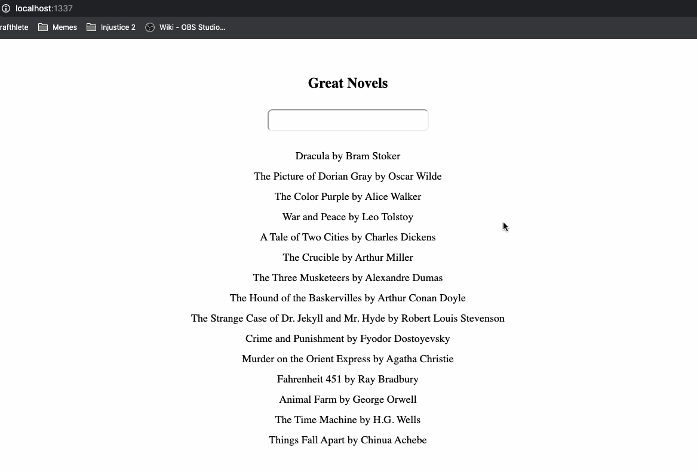

# Great Novels UI

## Instructions
In the initial commit of this project you have been provided with a fully functional REST API for retrieving data about great novels. Your task is to add a React front end to this project that will display a list of novels and include a search box allowing the user to search for particular novels by title. Your solution should be a true mono-repo with a single lint and dev npm script for the client and server.

